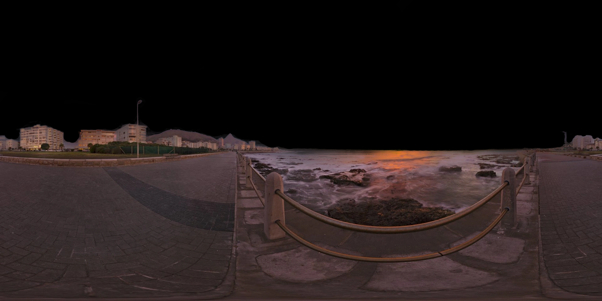
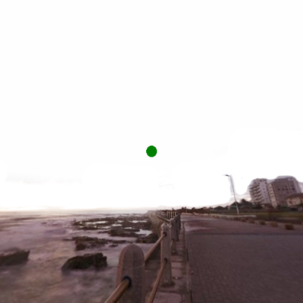

# AstroNTFY
Notifies you through the NTFY app of astronomical events. 

## Features
The current version has implemented notifications for:
1. Northern lights
2. ISS solar/lunar transits
3. Many/big sunspots
4. Comets

Every notification also includes the closest available weather forecast (cloud coverage and wind speed) to the relevant date and time.

You can also include a sentence in the relevant notifications about whether or not any obstacles at your observation point will block the event as well as an image of your sky and where the transit or comet will be. More info on how this is done [below](#Observation-point-horizon).

# Minimal setup

## Installation
Setup a virtual environment.
```sh
virtualenv venv
source venv/bin/activate
pip3 install -r requirements.txt
```

## Setup ntfy.sh app
In order for you to receive notifications, you will need the [ntfy.sh](https://ntfy.sh/) app. Download this on the device(s) that will be receiving notifications.

Create a new topic in the app with a cryptic name that people won't guess. I used a password generator.

## Final setup
Finally, fill in the variables (latitude/longitude, ntfy topic, notification thresholds) in [variables_example.py](variables_example.py) and rename it to variables.py.

# Optional

## Observation point horizon
To be sure that the event (for example an ISS lunar transit) is visible from your observation point, you can add your own 360 degree equirectangular image. I have added an [example image](obs_horizon/horizon_example.png) in the obs_horizon folder:



You can capture such an image using any phone with apps like 360 Photo Cam on iOS. These apps usually offer at least one free download. 

After downloading the image you need to make the sky transparent using any photo editing software. Now replace the example photo with your horizon, make sure it is a png, the resolution does not matter and rename it to horizon.png. 

The final step is to line up the image to true north. This is a bit tricky, but try to find a landmark at your observation point that you can find easily in your 360 image. 

Check the angle of this landmark in the image using Stellarium, or the formula below:

1. $Az$ = azimuth
2. $x$ = x value of pixel
3. $width$ = x resolution of image

$Az=(\frac{x}{width})\times360$

Find the real azimuth for the landmark by standing exactly where you took the photo and use the compass app on your phone. 

Now subtract the two and you're left with the horizon_north_offset variable that you set in [variables_example.py](variables_example.py).

This is an example of an image you might receive with a notification showing where the comet will be in your sky.

