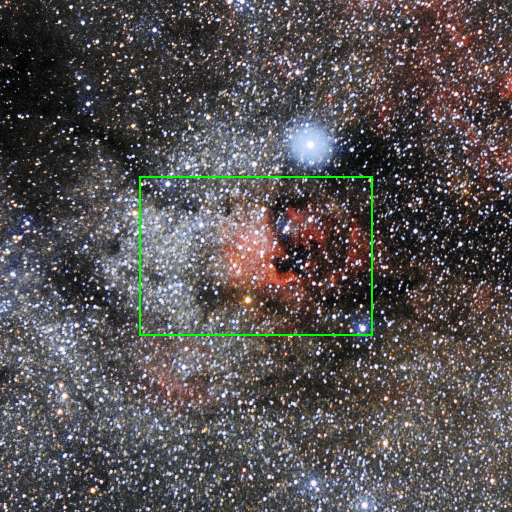
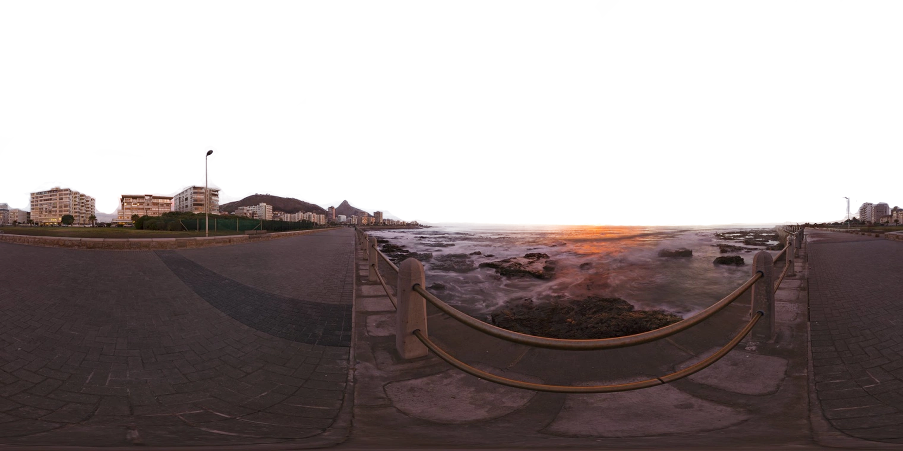
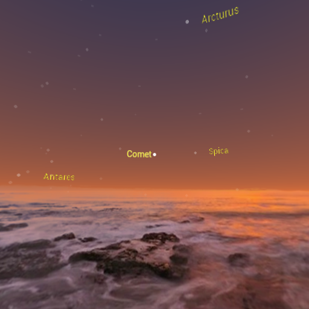

# AstroNTFY
Notifies you through the NTFY app of astronomical events. 

## Features
The current version has implemented notifications for:
1. Northern lights
2. ISS solar/lunar transits
3. Many/big sunspots
4. Comets
5. Lunar/solar eclipses
6. Good candidates for deep sky astrophotography every clear day (entire NGC and IC catalogs)

Every notification also includes the closest available weather forecast (cloud coverage and wind speed) to the relevant date and time.

You can also include a sentence in the relevant notifications about whether or not any obstacles at your observation point will block the event, as well as an image of your sky showing where the transit, comet or eclipse will be. More info on how this is done and what the result looks like [below](#Observation-point-horizon).

The astrophotography notifier picks good candidates (with some randomness) to image and sends a notification if the weather tonight looks good. It includes an [image of the FOV of your telescope+camera](#DSO_img) over the target object. 

# Minimal setup

## Installation
Setup a virtual environment and install the requirements. 

### Mac/linux
```sh
python3 -m venv venv
source venv/bin/activate
pip install -r requirements.txt
```

### Windows
```sh
python -m venv venv
venv\Scripts\activate.bat
pip install -r requirements.txt
```

## Setup ntfy.sh app
In order for you to receive notifications, you will need the [ntfy.sh](https://ntfy.sh/) app. Download this on the device(s) that will be receiving notifications.

Create a new topic in the app with a cryptic name that people won't guess. I used a password generator.

## Final setup
### Using the local web interface
Finally, run [app.py](app.py) and go to [astrontfy.localhost:5050](http://astrontfy.localhost:5050) to easily input and save the variables.py file. 

If you want the minimal setup, keep the 'deep sky object' off under notification schedule and keep 'use my own observation horizon' off under other settings. More on this [below](#optional). 

### Manual setup
If you prefer inputting the variables manually, you can do so and just change the name of [variables_example.py](variables_example.py) to variables.py. Latitude/longitude, elevation, ntfy topic and timezone are required for the program to run correctly.

There are also other variables for more control over the notifications, that is documented [there](variables_example.py).

## Running the program
Currently, you need to run the [main.py](main.py) file to check for all events and notify. You could for example have it run once every day using you operating systems task scheduler.

The first time you run the program, it will download a few files that are needed for some of the calculations such as ISS transits. 

# Optional
## Deep sky notificaitons
The deep sky notifier calculates what targets are good candidates for astrophotography tonight based on

* Target altitude
* Target magnitude
* Target surface brightness
* Narrowband suitability (if you have any filters in your [rig_config](variables_example.py))
* Moon position
* Framing based on focal length and sensor size

If you are using horizon images as well, the program will only give you targets that are visible from at least one of the observation points. 

<a id="DSO_img"></a>

Here is an example of an image you might recieve.



### Download sky survey
For the deep sky notifier, you need to donwload the [sky survey from noirlab](https://noirlab.edu/public/images/noirlab2430b/). As mentioned above, if you don't want to download anything, just skip this step and keep deep sky notification off. 

If your focal length is over 300mm, I recommend selecting the large JPEG. If you have anything less or would rather have a smaller file, use the publication JPEG. 

### Using the local web interface
After enabling the deep sky notification under notification schedule in the [app.py](app.py), you will be presented with the option to download one of the two images to the folder. 


### Manual setup
If you are setting up variables manually, download one of these images and put it in the same folder as [main.py](main.py)

* [Large JPEG](https://storage.noirlab.edu/media/archives/images/large/noirlab2430b.jpg)
* [Publication JPEG](https://storage.noirlab.edu/media/archives/images/publicationjpg/noirlab2430b.jpg)

## Observation point horizon
To be sure that the event (for example an ISS lunar transit) is visible from your observation point, you can add your own 360 degree equirectangular image. You can have multiple horizon images in this folder, just keep in mind they are all using the same location (latitude, longitude). I have added an [example image](obs_horizon/horizon_example.png) in the obs_horizon folder:



### Capturing the image
You can capture such an image using any phone with apps like 360 Photo Cam on iOS. These apps usually offer at least one free download. 

After downloading the image you need to make the sky transparent using any photo editing software. 

### Calculating north offset
Now you need to line up the image to true north. This is a bit tricky, but try to find a landmark at your observation point that you can find easily in your 360 image. 

Check the angle of this landmark in the image using Stellarium, or the formula below:

1. $Az$ = azimuth
2. $x$ = x value of pixel
3. $width$ = x resolution of image

$Az=(\frac{x}{width})\times360$

Find the real azimuth for the landmark by standing exactly where you took the photo and use the compass app on your phone. 

Now subtract the calculated azimuth (angle in your image) from the measured azimuth and you're left with the horizon north offset. There are many ways to do this of course, some are probably easier and more precise. This is only a suggestion.

### Uploading the image
#### Using the local web interface
Simply check use my own observation horizon and press add horizon image to upload your own image and input the north offset in the right field. 

### Manual setup
Add your final horizon images to the obs_horizon folder and add the north offset as well as the file name to the [variables file](variables_example.py).

### Result
Here is an example image you might receive with a notification showing where a comet will be in your sky with your horizon image as a foreground.

